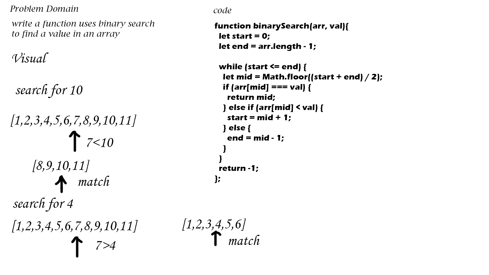

# Array binary search
search for a value inside an array using the binary search method

## Challenge
achieving this without using built in functions

## Approach & Efficiency
create a while loop that matches the value with the mid-point of the array, if no match is made then there is two cases:
1- the value is higher than the midpoint=> match the value with the midpoint of the second half of the array
2- the value is lower than the midpoint=> match the value with the midpoint of the first half of the array

the above is repeated until a match is made, if no match is made then -1 is returned

## Solution
