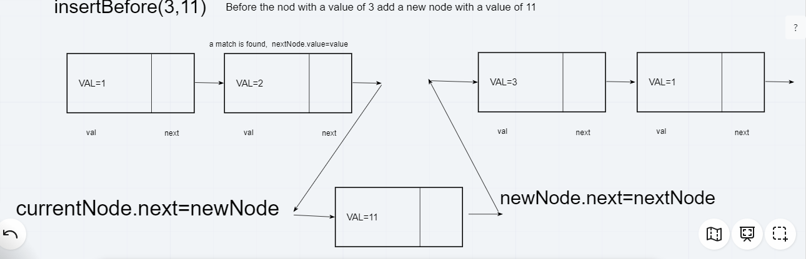
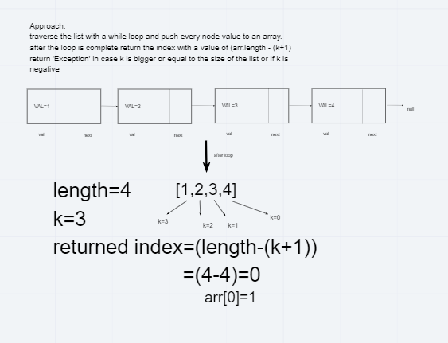
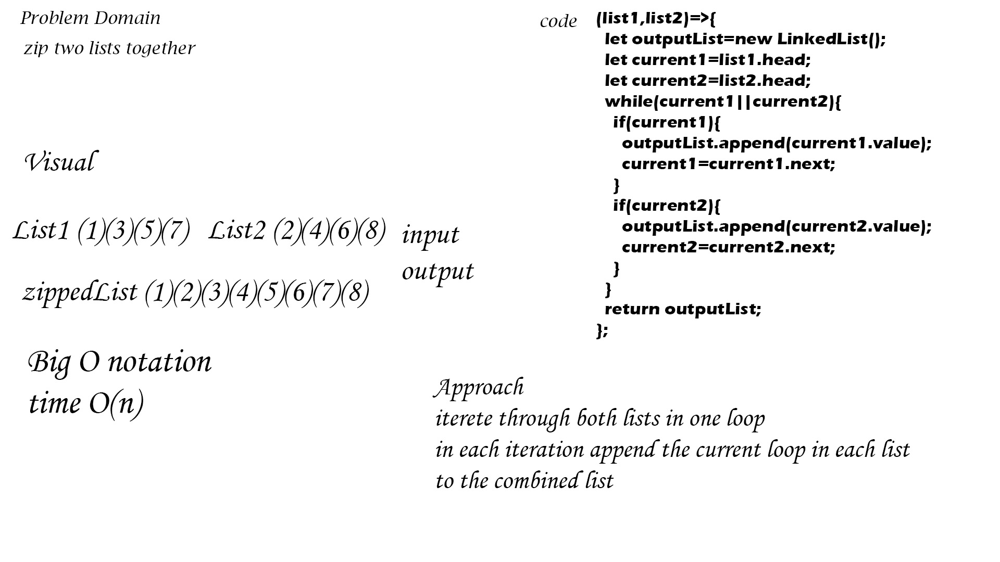

# Singly Linked List
implementing linked lists data structure in Javascript 
## Challenge
getting familiar with the new data structure and its implementation
## Approach & Efficiency
used while loops for traversing the list and applying all the methods 
## API
insert(value): add a new node to the beginning of the linked list
includes(value): returns a boolean based on wether or not a specific value exists in the list
toString(): creates a string that is a visual representation of the linked list
append(value): add a new node to the end of the linked list
insertBefore(value,newVal): insert a new node before the node with the given value
insertAfter(value,newVal): insert a new node after the node with the given value
kthFromEnd(k): returns the Kth value from the end of the list

