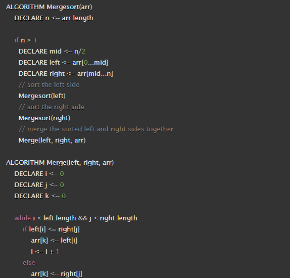

# Merge Sort
Insertion sort is a simple sorting algorithm that works similar to the way you sort playing cards in your hands. The array is virtually split into a sorted and an unsorted part. Values from the unsorted part are picked and placed at the correct position in the sorted part.

## Pseudo code

## Trace
Sample Array: [4,8,7,2,11,1,3]

## Efficiency
* Time Complexity: Sorting arrays on different machines. Merge Sort is a recursive algorithm and time complexity can be expressed as following recurrence relation. 
T(n) = 2T(n/2) + θ(n)
* Auxiliary Space: O(n)