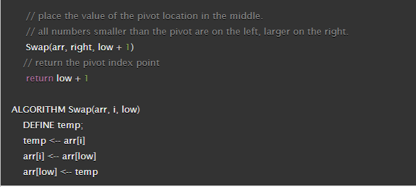
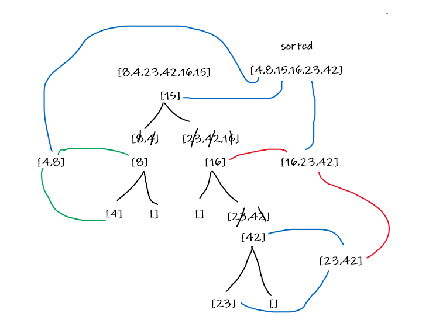

# quick sort
The simplest algorithmic steps for Quicksort is:
Pick a pivot element that divides the list into two sublists. We can select a random element as the pivot.
Reorder the list so that all elements less than the pivot element are placed before (towards its left) the pivot and all elements greater than the pivot are placed after it (towards its right).
Repeat steps 1 and 2 on both the smaller and larger list. That is, Recursively apply the above steps to the sub-array of elements with smaller values and separately to the sub-array of elements with greater values.

# Pseudo Code

# Visual 
sample array: [8,4,23,42,16,15]

